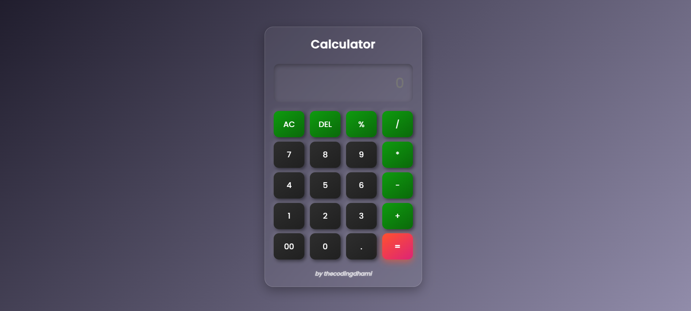

# Calculator - By thecodingdhami

A simple, responsive, and modern **Calculator** built with HTML, CSS, and JavaScript. It supports basic arithmetic, percentage calculations, and keyboard input for easy use.

---

## 🌟 Features

* ✅ Basic Operations: Addition, Subtraction, Multiplication, Division
* ✅ Additional Functions: Percent (`%`), Clear (`AC`), Delete (`DEL`)
* ✅ Responsive Design: Works on desktops, tablets, and mobile devices
* ✅ Keyboard Support: Type numbers and operators directly from your keyboard
* ✅ Modern UI: Gradient buttons, smooth hover effects, and animated input

---

## 🖼 Screenshots

---

## 🚀 Live Demo

You can try the calculator online here:
[Live Calculator Demo](https://thecodingdhami.github.io/simple-calculator/)

---

## 💻 Technologies Used

* HTML5
* CSS3
* JavaScript

---

## 📌 Usage Notes

* **AC** → Clear all input
* **DEL** → Delete last character
* **= or Enter** → Evaluate the expression
* Works with **keyboard input** for numbers and operators

---

## 📱 Responsive Design

* Fully adaptive layout for mobile and tablet screens
* Buttons and input field scale properly for touch devices

---

## ⚡ License

This project is licensed under the **MIT License**.

---

### ✨ Author

**thecodingdhami** <i>by Dinesh Singh Dhami</i>
